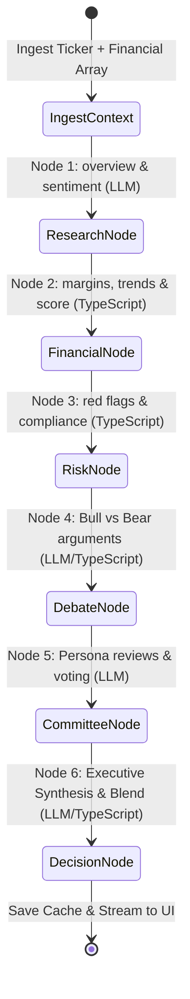
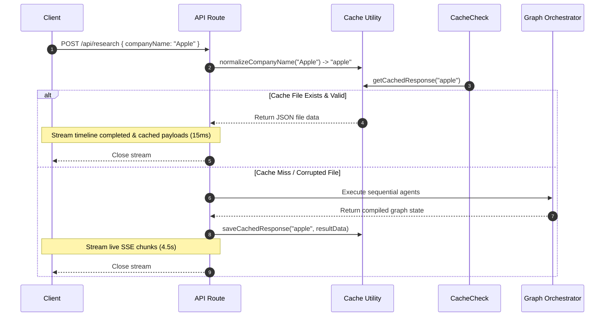
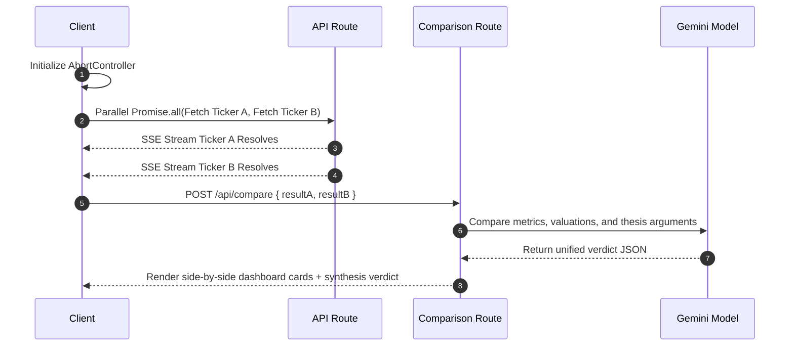

# Technical Architecture & System Flow

This document details the system design, network routing, state transitions, and component layouts of the **InvestIQ AI** platform.

---

## 1. High-Level Overview

InvestIQ AI is a modular, high-fidelity investment research platform that balances qualitative market reasoning with quantitative financial accuracy. The system avoids traditional single-prompt chatbot limitations by orchestrating specialised tasks inside a stateful graph powered by **LangGraph.js**.

The platform is designed around a **hybrid runtime strategy**:
1. **TypeScript Compute Layer**: Calculates margins, leverage ratios, growth indices, and investment compliance rules mathematically to ensure zero-hallucination accuracy.
2. **Generative LLM Reasoning Layer**: Confined strictly to high-level analysis, overview synthesis, sentiment analysis, debate role-playing, and investment committee voting.
3. **Local Cache Layer (Research Vault)**: Intercepts queries in development mode, bypassing external LLM round-trips for previously searched assets.
4. **Asynchronous Streaming Layer (SSE)**: Serializes graph transitions and pushes progress markers instantly to the browser client.

---

## 2. Problem Statement & Architecture Goals

### The Challenges of Standard LLM Wrappers
* **Mathematical Inaccuracy**: LLMs are auto-regressive text engines, meaning they estimate numbers based on word probabilities rather than doing arithmetic. This causes inaccurate reports of metrics like operating margin and debt-to-equity.
* **Token Overhead & Rate Limits**: Running multi-persona analyses (e.g. Growth, Value, and Risk experts) typically requires launching independent prompts. This increases daily API quota utilization.
* **Truncation Failures**: Large JSON payloads returned by LLMs are frequently cut off when output limits are reached, resulting in un-parsable strings that crash client-side UIs.

### Architecture Goals
* **Reliability**: Confine calculations to code, and use LLMs only for reasoning.
* **Optimized Latency**: Consolidate prompts to reduce API requests.
* **Resilience**: Implement validation checks to catch corrupted payloads and fall back to procedural models when API limits are reached.
* **Development Efficiency**: Store API responses locally to support offline UI development.

---

## 3. System Architecture Diagram

```mermaid
graph TD
    %% Clients & Interfaces
    Client[React Frontend / Browser] <-->|Server-Sent Events| Router[Next.js API Router: /api/research]
    
    %% API and Cache Check
    Router -->|1. Normalize Ticker| Normalizer[lib/cache.ts]
    Normalizer -->|2. Check Cache| CacheCheck{USE_CACHE == true?}
    
    %% Cache Hit Path
    CacheCheck -->|Cache Hit| LocalCache[cache/*.json]
    LocalCache -->|3. Read JSON & Stream instantly| Router
    
    %% Cache Miss Path
    CacheCheck -->|Cache Miss / Bypass| DbService[lib/services/financialData.ts]
    DbService -->|4. Load Income Statement, BS, CF Arrays| Graph[LangGraph Orchestrator]
    
    %% LangGraph Chain
    subgraph Graph Nodes (Sequential Chain)
        G1[1. consolidatedResearchAgent] -->|Overview & Sentiments| G2[2. financialHealthAgent TS]
        G2 -->|Deterministic Margins & Scores| G3[3. riskAnalysisAgent TS]
        G3 -->|Deterministic Compliance Red Flags| G4[4. debateAgents TS/Gemini]
        G4 -->|Optimized Bull/Bear Cases| G5[5. committeeAgent Gemini]
        G5 -->|Growth, Value, Risk Votes| G6[6. decisionAgent Gemini]
        G6 -->|Synthesize Overall Decision| G_End[State Graph Resolve]
    end
    
    %% Graph Post-Processing
    Graph -->|5. Compile Accumulated State| PostProc[Route Handler Post-Processor]
    PostProc -->|6. Save Output to cache/| LocalCache
    PostProc -->|7. Pushes Events Stream| Router
```

---

## 4. LangGraph Stateful Workflow

The system state is compiled through a sequence of nodes. It relies on `ResearchStateAnnotation` to flow data and append properties step-by-step.



### LangGraph State Definition (`langgraph/state.ts`)
The shared memory structure flows through the nodes using the following annotation configuration:
* `companyName` (String): Raw search text.
* `simulatorSettings` (SimulatorSettings): Horizon, risk appetite, and debate toggle options.
* `financialContext` (String): Structured string of financial statement arrays.
* `companyIntelligence` (CompanyIntelligence): Key officers, founded year, employee count, sector, and industry overview.
* `financialHealth` (FinancialHealthAnalysis): Math-precise margins, growth, and cash flow trends.
* `riskAnalysis` (RiskAnalysis): Red flags check, regulatory exposure, and sector challenges.
* `debate` (DebateOutput): Bull case and Bear case matching points.
* `committee` (InvestmentCommittee): Grow, Value, and Risk expert votes and consensus briefs.
* `decision` (DecisionAnalysis): Final blended scores and recommendation thesis.
* `timeline` (TimelineStep[]): Tracking logs.
* `error` (String): Caught error messages.

---

## 5. System Components & Engines

### 1. Consolidated Research Agent
* **Source**: [agents/research.ts](file:///c:/Projects/Investment/agents/research.ts)
* **API Calls**: **1 Gemini Call**
* **Logic**: Extracts description, business model, moat, founders, key executives, and headlines. Generates news sentiment, retail feelings, and bullish/bearish index values.

### 2. Programmatic Financial Engine
* **Source**: [agents/financial.ts](file:///c:/Projects/Investment/agents/financial.ts)
* **API Calls**: **0 Calls**
* **Logic**: Reads income statements and balance sheets, then calculates:
  $$\text{YoY Revenue Growth} = \frac{\text{Revenue}_t - \text{Revenue}_{t-1}}{\text{Revenue}_{t-1}} \times 100$$
  $$\text{Net Profit Margin} = \frac{\text{Net Income}}{\text{Revenue}} \times 100$$
  $$\text{Operating Margin} = \frac{\text{Operating Income}}{\text{Revenue}} \times 100$$
  $$\text{Debt-to-Equity Ratio} = \frac{\text{Total Liabilities}}{\text{Total Equity}}$$
  Assiders financial health scores (up to 98) using margin criteria, growth ranges, and leverage weights.

### 3. Rule-Based Risk Engine
* **Source**: [agents/risk.ts](file:///c:/Projects/Investment/agents/risk.ts)
* **API Calls**: **0 Calls**
* **Logic**: Programmatically flags active risks:
  * `High Debt` if $D/E > 1.8$
  * `Weak Cash Flow` if $FCF < 0$
  * `Negative Earnings` if $\text{Net Income} < 0$
  * `Declining Revenue` if $\text{YoY Growth} < 0$
  * `Overvaluation` if $P/E > 35$
  Appends pre-defined regulatory warning assessments depending on the company's sector.

### 4. AI Debate Coordinator
* **Source**: [agents/debate.ts](file:///c:/Projects/Investment/agents/debate.ts)
* **API Calls**: **0 or 1 Gemini Call**
* **Logic**: If debate is toggled off in settings, returns structured TypeScript cases instantly. If toggled on, queries Gemini to compile opposing investment perspectives.

### 5. AI Investment Committee
* **Source**: [agents/committee.ts](file:///c:/Projects/Investment/agents/committee.ts)
* **API Calls**: **1 Gemini Call**
* **Logic**: Role-plays Growth, Value, and Risk analyst perspectives. Tally votes and outputs a consensus recommendation.

### 6. Decision Synthesizer Agent
* **Source**: [agents/decision.ts](file:///c:/Projects/Investment/agents/decision.ts)
* **API Calls**: **1 Gemini Call**
* **Logic**: Blends quantitative scores, analyst opinions, and investment horizons to output a final score:
  $$\text{Overall Score} = (\text{Financial Health} \times 0.4) + (\text{Risk Score} \times 0.3) + (\text{Sentiment Score} \times 0.3) + \text{Appetite Modifier}$$

---

## 6. Data Streaming & Caching Flow

### SSE Stream Interface
* When the client triggers a POST request to `/api/research`, the response establishes a persistent Server-Sent Events (SSE) connection:
  `Content-Type: text/event-stream`
* Each node sends a JSON update as it executes, including `'timeline'`, `'intelligence'`, `'financial'`, `'risk'`, `'sentiment'`, `'debate'`, `'committee'`, and `'decision'` events.

### Caching Bypass Routing


---

## 7. Company Comparison Workflow



When comparing two companies:
1. **Parallel Execution**: Dual fetch connections stream progress logs independently, populating two separate dashboards in the UI.
2. **Synthesis Call**: Once both analyses resolve, the client makes a comparison call to `/api/compare` to determine the better investment choice.
