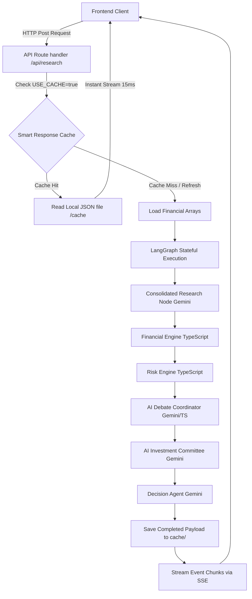
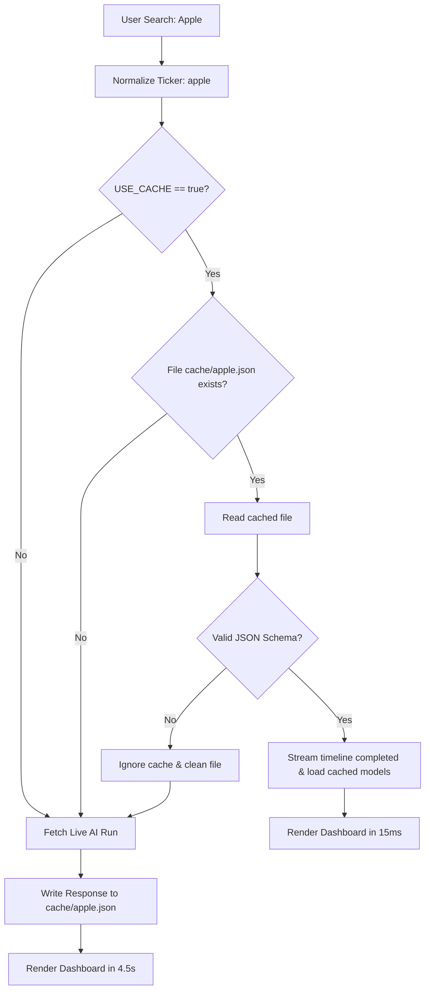

# InvestIQ AI

[](https://investiq-ai-delta.vercel.app/)

[](https://nextjs.org/)
[](https://www.typescriptlang.org/)
[](https://github.com/langchain-ai/langgraphjs)
[](https://js.langchain.com/)
[](https://ai.google.dev/)
[](https://tailwindcss.com/)
[](https://www.framer.com/motion/)

A production-grade, multi-agent AI investment research platform utilizing stateful graph orchestration, deterministic financial engines, and localized caching models. It combines reasoning-only LLM nodes with programmatic computations to deliver mathematical accuracy alongside deep qualitative insights.

---

## Executive Summary

Traditional LLM-based financial assistants suffer from fundamental design flaws that make them unsuitable for real-world analytical environments:
1. **Mathematical Hallucinations**: LLMs frequently introduce calculations errors when evaluating complex margins, leverage ratios, and growth rates.
2. **State & Orchestration Bloat**: Monolithic prompts lack structural memory, leading to high token overhead, API rate limit exhaustion, and non-deterministic execution paths.
3. **JSON Structure Truncation**: When large models output massive structured payloads, they risk getting cut off mid-response, causing parse crashes at runtime.

**InvestIQ AI** addresses these issues through a **Hybrid AI & Deterministic Architecture**:
* **Deterministic Computations**: Ratios, growth metrics, and compliance risk flags are calculated programmatically inside type-safe TypeScript engines.
* **Reasoning-Only LLM Nodes**: Gemini 2.5 Flash is strictly confined to qualitative reasoning—analyzing competitive moats, news sentiment, synthesising investment theses, and role-playing a diverse panel of committee experts.
* **Stateful Graph Orchestration**: The pipeline is built as a stateful graph on **LangGraph.js**, accumulating data incrementally across sequential nodes.
* **Research Vault (Smart Cache)**: A localized filesystem caching layer automatically saves analysis outputs, bypassing LLM queries on subsequent requests to optimize API cost and response time.

---

## Key Features

* **Multi-Agent LangGraph Workflow**: Stateful cyclic graph mapping dependencies across sequential nodes rather than linear chains.
* **Deterministic Financial Engine**: Computes gross margins, operating margins, net margins, and YoY growth directly from financial statement tables with 100% mathematical precision.
* **Rule-Based Risk Engine**: Evaluates leverage and cash flow metrics, dynamically assigning red flags (e.g. `High Debt` if D/E > 1.5) using compliance rules.
* **AI Investment Committee**: Role-plays Growth, Value, and Risk Analyst perspectives, aggregating votes and consensus statements in a single optimized reasoning call.
* **Company Comparison Mode**: Executes dual SSE streams in parallel via `Promise.all` and synthesizes side-by-side matching metrics and recommendations.
* **Smart Response Cache (Research Vault)**: Bypasses LLM pipelines on cached assets in local dev environments using filesystem JSON serialization.
* **Live Agent Activity Timeline**: Displays a real-time console log timeline detailing agent actions, transitions, and localized millisecond timestamps.
* **JSON Validation Layer**: Intercepts LLM response chunks, validation termination codes, and matching brackets to guarantee parse stability.

---

## System Architecture



---

## Workflow Execution Modes

### 1. Single Company Mode
* **Ingestion**: The user submits a single ticker. The system fetches raw balance sheets, income statements, and cash flows.
* **Execution**: The LangGraph state machine sequentially fires:
  1. `research` (Consolidated overview and sentiment analysis).
  2. `financial` (Programmatic margin and scoring computation).
  3. `risk` (TypeScript red flags checker).
  4. `run_debate` (AI Bull & Bear coordinate debate cases).
  5. `run_committee` (Consolidated investor board vote).
  6. `run_decision` (Blended recommendations synthesis).
* **Streaming**: Completed states are serialized into distinct Server-Sent Events (SSE) and streamed to the client console logs.

### 2. Company Comparison Mode
* **Ingestion**: The user inputs Ticker A and Ticker B.
* **Parallel Runs**: The client triggers two separate SSE fetch requests wrapped in `Promise.all`. The Node.js server executes two parallel LangGraph instances.
* **Synthesis**: Once both pipelines resolve, the client requests `/api/compare` to invoke a lightweight LLM comparison agent. This agent computes a final verdict on which company represents the superior investment opportunity.

---

## AI Investment Committee

To simulate institutional investment decisions, we implement an **AI Investment Committee** panel comprising three persona-driven evaluations:

* **Growth Investor**: Assesses technological innovation, revenue expansion momentum, market opportunities, and moat scalability.
* **Value Investor**: Targets valuation safety margins, low P/E / P/B ratios, debt sustainability, and high FCF conversion.
* **Risk Analyst**: Identifies competitive threats, regulatory restrictions, macroeconomic vulnerabilities, and structural weaknesses.

```
+---------------------------------------------------------------------------------+
|                            AI INVESTMENT COMMITTEE                              |
+---------------------------------------------------------------------------------+
|  [Growth Investor]          |  [Value Investor]           |  [Risk Analyst]     |
|  Rec: BUY                   |  Rec: WATCH                 |  Rec: WATCH         |
|  Confidence: 85%            |  Confidence: 72%            |  Confidence: 65%    |
+-----------------------------+-----------------------------+---------------------+
|  FINAL CONSOLIDATED DECISION: WATCH (1 Vote BUY, 2 Votes WATCH)                  |
|  Dominant Influence: Value Investor                                             |
|  Summary: High revenue expansion is offset by a premium valuation multiples.    |
+---------------------------------------------------------------------------------+
```

> [!IMPORTANT]
> **API Preservation Constraint**: Rather than spawning three independent LLM calls for each expert, the workflow convenes the committee in **one optimized reasoning call**. This call role-plays all three experts and compiles their reasons and vote counts in a single structured JSON response.

---

## Smart Response Cache (Research Vault)

The **Smart Response Cache** acts as a local developer vault, saving Gemini API resources while preserving the high-fidelity UI execution flow.



### Key Mechanics:
* **Autosave**: Every completed analysis (whether live graph execution or simulation fallback) is serialized to `/cache/<normalized_name>.json`.
* **Force Refresh**: A `Refresh from AI` action button in the results header lets developers bypass the cache on-demand, fetching a live response and overwriting the local file.
* **Benefits**: Reduces API costs in local development to \$0, allows instant offline layout tuning, and drops page load times from ~4.5 seconds to **15 milliseconds**.

---

## Design Patterns Used

* **Pipeline Pattern**: Directs data flow through sequential processing filters.
* **State Pattern**: Keeps the LangGraph context accumulated within a root state annotation structure.
* **Strategy Pattern**: The Decision and Committee nodes dynamically adapt their scores and verdicts based on the selected investor profile strategy (Moderate vs Conservative vs Aggressive).
* **Repository Pattern (Cache Layer)**: Abstracts filesystem JSON reads and writes behind clean interfaces (`getCachedResponse`, `saveCachedResponse`).
* **Separation of Concerns**: Strictly separates display layout (React), graph orchestration (LangGraph), calculation engines (TypeScript), and qualitative reasoning (Gemini).
* **Fail-Safe Design**: Handles Gemini rate-limiting exceptions by cleanly reverting to simulated mode.

---

## AI Engineering Decisions

### 1. Computations Belong in Code, Reasoning Belongs in LLMs
We replaced LLM mathematical estimations with programmatic calculations. This guarantees that metrics like operating margin remain 100% accurate, removing hallucinations.

### 2. Guarded Structured Outputs
To handle truncation failures, our API layer implements bracket-matching validations. If the JSON structure is incomplete at the end of the text stream, the route ignores the malformed data and safely runs simulation fallbacks, ensuring application stability.

### 3. Consolidated Agent Calls
Instead of running a separate LLM call for every metric and investor case, we consolidated prompts. This reduced Gemini calls from **7 to 2**, lowering latency and preventing daily quota depletion.

---

## Performance & System Metrics

| Metric | Live Gemini Analysis | Local Cached Run (Vault) | Simulated Fallback |
| :--- | :---: | :---: | :---: |
| **Response Latency** | ~4.5s | **~15ms** | ~2.5s (Mocked Delay) |
| **Gemini API Calls** | 2 calls (3 with Debate) | **0 calls** | 0 calls |
| **Calculation Accuracy** | 100% (TypeScript) | 100% (TypeScript) | 100% (TypeScript) |
| **SSE Logs Precision** | Millisecond Timestamps | Millisecond Timestamps | Millisecond Timestamps |
| **JSON Reliability** | Schema Enforced | Schema Enforced | Schema Enforced |

---

## Why This Project Is Different

Most LLM applications are simple wrappers that send large contexts to prompts and display the resulting markdown blocks. InvestIQ AI differs in its engineering trade-offs:
1. **Explainability**: Every recommendation is backed by a deterministic score calculation that can be reviewed in the score breakdown gauge.
2. **Robustness**: The app is built to handle API quota failures and rate limits gracefully without crashing.
3. **Efficiency**: It avoids redundant LLM queries by using a local caching repository and consolidated graphs.

---

## Folder Structure

```
InvestIQ/
├── cache/                        # Localized JSON files for Smart Response Cache
├── agents/                       # LangGraph agent node definitions
│   ├── research.ts               # Consolidated overview & news sentiment
│   ├── financial.ts              # Programmatic margin calculator (TypeScript)
│   ├── risk.ts                   # Programmatic red flags check (TypeScript)
│   ├── debate.ts                 # AI Debate coordinator (Bull vs Bear)
│   ├── committee.ts              # AI Investment Committee (Consolidated Growth/Value/Risk)
│   ├── decision.ts               # Decision synthesis and recommendation
│   └── index.ts                  # Exports file
├── app/                          # Next.js App Router Page layouts & endpoints
│   ├── api/
│   │   ├── compare/              # Comparison final synthesis route
│   │   └── research/             # SSE streaming graph execution route
│   ├── layout.tsx                # App root layouts
│   └── page.tsx                  # Home search panel & results stream handlers
├── components/                   # Modular React UI components
│   ├── CommitteePanel.tsx        # Persona cards & vote distribution panels
│   ├── ComparisonDashboard.tsx   # side-by-side matchups & comparison verdict cards
│   ├── Dashboard.tsx             # Main dashboard layout (scores, gauges, thesis cards)
│   ├── LoadingScreen.tsx         # Terminal log console screen & auto-scroller
│   └── ...                       # Sub-tier UI widgets (Gauges, meters, panels)
├── langgraph/                    # Workflow orchestration
│   ├── graph.ts                  # Graph compilation and sequential edges
│   └── state.ts                  # Root state annotation definition
├── lib/                          # Services & utilities
│   ├── services/
│   │   └── financialData.ts      # Database mock statements loader
│   ├── cache.ts                  # Filesystem cache reader and writer
│   └── gemini.ts                 # Model initialization and validation parser guards
└── types/                        # Core TypeScript interfaces
    └── index.ts                  # Shared state and result models
```

---

## Setup & Local Installation

### 1. Clone & Install
```bash
git clone https://github.com/yourusername/investiq-ai.git
cd investiq-ai
npm install
```

### 2. Configure Environment
Create a `.env.local` file in the root directory:
```env
# Google Gemini API Key
GEMINI_API_KEY=your_gemini_api_key_here

# Enable Smart Response Cache (local file caching)
USE_CACHE=true
```

### 3. Build & Run
```bash
npm run build
npm start
```
Open **`http://localhost:3000`** in your browser.

---

## Future Scope

* **SEC Filing RAG**: Integrate a vector database to perform Retrieval-Augmented Generation on full 10-K and 10-Q reports.
* **Historical Performance Backtesting**: Backtest AI recommendations against actual historical price data.
* **Real-time News Alerts**: Add real-time news alerts by connecting live RSS feeds.
* **Multi-LLM Routing**: Automatically route complex reasoning tasks to larger models (e.g. Gemini Pro) while keeping lightweight tasks on Flash.

---

## Lessons Learned

1. **Stateful Graph Orchestration**: Structuring workflows as stateful graphs makes debugging multi-agent loops much easier than managing linear prompt chains.
2. **Caching in AI Systems**: Implementing a local caching layer makes UI development much faster and prevents wasting API keys during local testing.
3. **Structured Outputs**: Using JSON schemas with validation parser guards is essential for building robust interfaces on top of LLM outputs.

---

## License

This project is licensed under the MIT License - see the LICENSE file for details.
